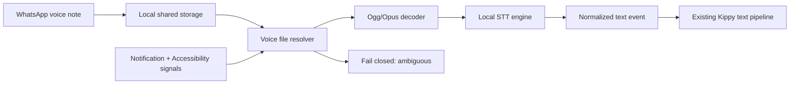

# תשתית הודעות קוליות מ־WhatsApp — מקור אמת לעבודה

| שדה | ערך |
|---|---|
| סטטוס | מסמך עבודה קנוני; בסיס עבודה ל־PoC |
| גרסה | 0.3 |
| עודכן לאחרונה | 28 ביולי 2026 |
| תחום | אפליקציית ה־Android במכשיר הילד, WhatsApp ותמלול מקומי |
| בעלות | Kippy — Product + Android + Backend |

> זהו מקור האמת היחיד עבור תשתית ההודעות הקוליות בגרסה הנוכחית. אם החלטה, חוזה נתונים או ארכיטקטורה משתנים, יש לעדכן מסמך זה באותו PR שבו מתבצע השינוי. אין להסתמך על תשתיות ישנות במאגר או על שיחות קודמות שאינן משתקפות כאן.

מסמך נלווה: [פרומפט Handoff לסוכן Android — מיזוג תשתית הודעות קוליות](AGENT_HANDOFF_PROMPT.md).

## 1. תקציר מנהלים

המטרה היא להפוך הודעה קולית נכנסת ב־WhatsApp, שהגיעה למכשיר הילד, לאירוע טקסט רגיל בצינור הניתוח הקיים של Kippy.

הארכיטקטורה שנבחרה:

1. WhatsApp מוריד את ההודעה הקולית לקובץ מקומי במכשיר.
2. Kippy מקבל מההורה הרשאת קריאה מצומצמת לתיקיית ההודעות הקוליות.
3. Kippy מקטלג את קובץ הקול ומקשר אותו להודעה שנצפתה או הופעלה ב־WhatsApp.
4. הקובץ מפוענח מקומית מ־Ogg/Opus ל־PCM.
5. מודל STT קטן מתמלל את האודיו על מכשיר הילד.
6. התמלול נכנס לצינור הקיים כהודעת טקסט, עם metadata פנימי שמסמן שמקורו בהודעה קולית.
7. קובץ האודיו לעולם אינו נשלח לשרת של Kippy או לספק AI חיצוני.

הסיכון הטכני המרכזי אינו התמלול. הסיכון המרכזי הוא גישה אמינה לקובץ המקומי ושיוך חד־משמעי שלו להודעה הנכונה ב־WhatsApp.

## 2. החלטות מחייבות

| מזהה | החלטה | סטטוס |
|---|---|---|
| D-01 | בגרסה הנוכחית אין הודעות פנימיות בתוך Kippy. מקור ההודעות הקוליות הוא WhatsApp בלבד. | סגור |
| D-02 | אין להקליט את הרמקול, את המיקרופון או את ה־playback. קוראים את קובץ האודיו המקומי. | סגור |
| D-03 | האודיו מפוענח ומתומלל על מכשיר הילד ואינו עוזב אותו. | סגור |
| D-04 | הרשאת SAF לתיקיית `WhatsApp Voice Notes` היא מסלול הגישה הראשי. | סגור ל־PoC |
| D-05 | מנוע הליבה יהיה מודל STT מקומי שבשליטת Kippy ולא שירות ענן. | סגור |
| D-06 | התוצר נשלח כהודעת טקסט רגילה עם `source_kind=voice_transcript`; אין להכניס סימון לתוך הטקסט עצמו. | סגור |
| D-07 | שיוך שגוי אסור. כאשר אין התאמה חד־משמעית, האירוע מסומן `AMBIGUOUS` ואינו נכנס לצינור הטקסט. | סגור |
| D-08 | Kippy פועל בשקיפות: התקנה והגדרה בידי ההורה וחיווי קבוע במכשיר הילד. | סגור |
| D-09 | ML Kit GenAI Speech Recognition אינו מנוע הליבה של הפרודקשן. | סגור |
| D-10 | גילוי הקובץ מתבצע עם הגעתו. רגע התמלול יהיה configurable: `ON_OPEN` או `ON_ARRIVAL`; ברירת המחדל ל־PoC היא `ON_OPEN`. | פתוח להחלטת מוצר |
| D-11 | הודעות קוליות מסוג View Once אינן נתמכות ב־v1. | סגור |
| D-12 | הפיצ'ר פעיל רק אם שני דגלי ההפעלה הקיימים מאשרים אותו והמכשיר מסומן `voice_supported=true`; כל `false` הוא kill switch. | סגור |
| D-13 | מיד לאחר חיבור המכשיר, ולפני הורדת מודל או הפעלת ניטור קולי, Kippy מבצע Voice Device Eligibility Preflight. מכשיר שלא עומד במדיניות הקול אינו מפעיל את היכולת בשיטת “ננסה ונראה אם יקרוס”; ההורה מקבל הודעת אי־התאמה ברורה מראש. | סגור |
| D-14 | שם היצרן והדגם הם אות ראשוני בלבד. החלטת הזכאות משלבת מדיניות דגמים עם נתוני runtime ובדיקת capability מוגבלת, משום שלאותו דגם עשויים להיות וריאציות RAM, ABI, מערכת הפעלה ומצב אחסון שונים. | סגור |
| D-15 | זכאות לשירות Kippy הבסיסי וזכאות להרחבת הקול הן שתי החלטות נפרדות. אם ניטור הטקסט נתמך אך תמלול הקול אינו נתמך, אין לחסום את המוצר הבסיסי. ההורה יוכל להמשיך עם ניטור טקסט בלבד או לבחור בעתיד במוצר המורחב באמצעות מכשיר מתאים. | סגור |
| D-16 | יכולת טכנית, בחירת חבילה ו־entitlement מסחרי הם מושגים נפרדים. בגרסה הנוכחית בונים רק את זיהוי היכולות ואת נקודת ההרחבה העתידית; אין לבנות כעת חבילות, תמחור, רכישה או הרשאות מסחריות. | סגור |

## 3. גבולות המוצר

### 3.1 בתוך ה־scope

- מכשירי Android של ילדים בגילאי 6–14, שהוגדרו בידי הורה.
- WhatsApp רגיל במכשיר ובאותו Android user/profile שבו פועל ה־agent של Kippy.
- הודעות קוליות נכנסות מסוג voice note/PTT.
- הורדה מקומית, גילוי, קורלציה, פענוח ותמלול על המכשיר.
- שילוב התמלול בצינור ניתוח הטקסט הקיים.
- feature flags, דירוג מכשיר, telemetry ו־fallback בטוח.
- חיווי גלוי שה־agent פועל ברקע.

### 3.2 מחוץ ל־scope של v1

- הודעות או צ'אט פנימיים בתוך Kippy.
- שיחות קוליות או שיחות וידאו.
- הקלטת שמע דרך המיקרופון.
- `AudioPlaybackCapture` או `MediaProjection` כנתיב עבודה.
- העלאת קובץ הקול לענן.
- iOS.
- WhatsApp View Once voice messages.
- קובצי Audio כלליים שנשלחו כקובץ מצורף ואינם voice note/PTT.
- root, שינוי WhatsApp, קריאת מסד הנתונים הפרטי של WhatsApp או עקיפת מנגנוני Android.
- WhatsApp Business, Dual Apps, Work Profile ו־cloned apps אינם מובטחים ב־v1; הם ייבדקו בנפרד.

### 3.3 תשתיות קיימות שאינן שייכות לגרסה הזו

במאגר קיימות מיגרציות ורכיבי UI מגרסה אחרת שבה `chat_messages.message_type` יכול להיות `voice`. אסור לחבר את תשתית WhatsApp המתוארת כאן ל־Kippy Chat או להשתמש ב־`message_type=voice` של אותה תשתית. מבחינת צינור הניתוח הנוכחי, תמלול קולי הוא הודעת `text` עם metadata פנימי.

## 4. מילון מונחים

- **Parent app** — הממשק שבו ההורה רוכש, מתקין, מאשר ומנהל את Kippy.
- **Child agent** — רכיב Android שפועל במכשיר הילד. לילד אין חשבון ניהול או יכולת להפעיל את מנגנון התמלול.
- **Voice artifact** — קובץ אודיו מקומי ש־WhatsApp שמר במכשיר.
- **Discovery** — זיהוי שקובץ חדש הופיע וזמין לקריאה.
- **Correlation** — שיוך בין קובץ מקומי לבין בועת הודעה או פעולת play ב־WhatsApp.
- **Opened inferred** — אות הסתברותי שלפיו הילד פתח או הפעיל הודעה; אין API ציבורי של WhatsApp שמספק אמת דטרמיניסטית בנושא.
- **Normalized text event** — אובייקט טקסט שנכנס לצינור Kippy הרגיל ומכיל סימון פנימי של מקור קולי.
- **RTF** — זמן תמלול חלקי משך האודיו. `RTF=1` פירושו דקת חישוב עבור דקת אודיו.

## 5. זרימת המידע



### 5.1 רצף מפורט

1. ההורה מתקין ומגדיר את אפליקציית הילד.
2. ההורה מפעיל ב־WhatsApp הורדה מקומית של אודיו ומעניק ל־Kippy גישה לתיקיית Voice Notes.
3. תהליך onboarding שולח או מקבל הודעת בדיקה ומוודא שקובץ נוצר, נקרא ומפוענח.
4. Kippy מקטלג קבצים חדשים מבלי לשנות או למחוק את המקור.
5. Notification Listener, Accessibility ואירועי קבצים מספקים אותות לקורלציה.
6. לאחר התאמה יחידה ובטוחה, Kippy מעתיק את הקובץ ל־private cache.
7. Kippy בודק שהקובץ שלם, מפענח אותו וממיר ל־PCM מונו 16kHz.
8. מנוע STT מקומי מפיק תמלול.
9. Kippy יוצר `NormalizedTextEvent` עם `source_kind=voice_transcript`.
10. האירוע עובר לצינור הטקסט הקיים.
11. העותק הזמני וה־PCM נמחקים.
12. telemetry טכני נשלח ללא אודיו, תמלול, URI, שם איש קשר או שם צ'אט.

## 6. גישה לקובצי WhatsApp

### 6.1 מיקום הקבצים

במכשירי Android חדשים הנתיב הנצפה בדרך כלל הוא:

```text
/storage/emulated/0/Android/media/com.whatsapp/WhatsApp/Media/WhatsApp Voice Notes/
```

במכשירים או בגרסאות ישנות יותר נצפה גם:

```text
/storage/emulated/0/WhatsApp/Media/WhatsApp Voice Notes/
```

זהו פרט מימוש של WhatsApp, לא API ציבורי ולא חוזה יציב. אין לקודד נתיב יחיד ולהניח שהוא נכון לכל מכשיר. יש לגלות ולאמת את התיקייה בזמן onboarding.

### 6.2 המסלול הראשי: Storage Access Framework

ה־agent יפעיל `ACTION_OPEN_DOCUMENT_TREE`, וההורה יבחר פעם אחת את תיקיית `WhatsApp Voice Notes`. לאחר מכן נשמור הרשאת URI מתמשכת באמצעות `takePersistableUriPermission`.

Android 11 ומעלה חוסם בחירה של root, `Download`, `Android/data` ו־`Android/obb`; `Android/media` אינו מופיע ברשימת החסימות. עם זאת, DocumentsProvider או file picker של יצרן מסוים עלול להתנהג אחרת ולכן נדרש PoC על מכשירים אמיתיים.

מקור רשמי: [Access documents and other files from shared storage](https://developer.android.com/training/data-storage/shared/documents-files).

כללי יישום:

- לבקש הרשאת קריאה בלבד.
- לשמור `treeUri` ב־storage הפרטי של Kippy.
- לבצע בדיקת read אמיתית ולא להסתפק בכך שההרשאה מופיעה כמאושרת.
- לבדוק מחדש לאחר reboot, עדכון WhatsApp ושינוי תיקייה.
- אם ההרשאה בוטלה, לעצור את היכולת ולהציג להורה הוראות תיקון.
- אין FileObserver אחיד ואמין על כל `content://` provider; יש לתמוך ב־delta scan ממוקד.

### 6.3 מסלול מהיר אופציונלי: MediaStore

ב־Android 13 ומעלה ניתן לבקש `READ_MEDIA_AUDIO`; בגרסאות קודמות נעשה שימוש ב־`READ_EXTERNAL_STORAGE` לפי גרסת המערכת ו־target SDK.

המסלול שימושי רק אם קובץ WhatsApp מופיע ב־`MediaStore.Audio`. קובץ או תיקייה שמוסתרים באמצעות `.nomedia` עלולים לא להופיע באינדקס, ולכן MediaStore הוא fast path ולא מקור הגישה היחיד.

מקורות רשמיים:

- [Granular media permissions](https://developer.android.com/about/versions/13/behavior-changes-13#granular-media-permissions)
- [Access media files from shared storage](https://developer.android.com/training/data-storage/shared/media)
- [`.nomedia` / `MEDIA_IGNORE_FILENAME`](https://developer.android.com/reference/android/provider/MediaStore#MEDIA_IGNORE_FILENAME)

### 6.4 מה לא עושים

- לא מבקשים `MANAGE_EXTERNAL_STORAGE` באפליקציית Play ציבורית עבור שימוש זה. Google Play מגדיר גישה לקובצי מדיה כמקרה שבו יש להשתמש ב־MediaStore או SAF, והסיכוי לדחיית All Files Access גבוה.
- לא קוראים `Android/data`, `/data/data/com.whatsapp` או מסדי נתונים פרטיים.
- לא משתמשים ב־MediaProjection.
- לא מניחים שהצפנה מקצה לקצה מבטיחה או שוללת קובץ plaintext ב־shared storage; בודקים בפועל.

מקורות:

- [All files access on Android](https://developer.android.com/training/data-storage/manage-all-files)
- [Google Play policy for All files access](https://support.google.com/googleplay/android-developer/answer/10467955)

### 6.5 בדיקות eligibility ו־onboarding

מיד לאחר שה־pairing מסתיים וה־device profile מתקבל, Kippy קובע שתי יכולות נפרדות:

1. **Core/Text Eligibility** — האם המכשיר יכול להפעיל את שירות ניטור הטקסט הבסיסי.
2. **Voice Eligibility** — האם אותו מכשיר יכול להפעיל גם את הרחבת ההודעות הקוליות.

רק כשל ב־Core/Text Eligibility חוסם את שירות Kippy כולו. כשל ב־Voice Eligibility משאיר את המוצר הבסיסי זמין ואינו משנה או עוצר את צינור הטקסט.

לפני הורדת מודל קולי, הרשאת תיקיית הקול או הפעלת voice worker, יש לבצע Voice Device Eligibility Preflight:

1. נאסף device profile מינימלי: manufacturer/model, Android API, ABI, RAM זמין/כולל, שטח פנוי, app version וגרסת מנוע/מודל מתוכננת.
2. הפרופיל נבדק מול Voice Eligibility Policy קנונית ובעלת `policy_version`.
3. כשל קשיח מסווג מיד `UNSUPPORTED`; לא מורידים מודל, לא מפעילים voice worker ולא ממשיכים ל־voice onboarding. ניטור הטקסט יכול להמשיך.
4. דגם חדש או תוצאה שאינה חד־משמעית מסווגים `CAPABILITY_TEST_REQUIRED`, ומורצת בדיקה מקומית קצרה, תחומה בזמן ובזיכרון, על sample קבוע שאינו תוכן של הילד.
5. רק תוצאת קול `ELIGIBLE` מאפשרת להמשיך: WhatsApp מותקן באותו user/profile.
6. התיקייה נבחרת וההרשאה נשמרת.
7. הודעת בדיקה נכנסת ונשמרת מקומית.
8. Kippy מצליח לפתוח את ה־URI לקריאה.
9. header ומשך האודיו מזוהים.
10. decoder מפיק PCM תקין.
11. benchmark מוגבל של המנוע עובר ללא OOM, ANR או חריגה מסף thermal/latency.

בזמן הבדיקה ההורה רואה מצב “בודקים התאמה להודעות קוליות”. בתוצאה שלילית מוצגת הודעה לפני הפעלת הרחבת הקול, עם סיבה מובנת ופעולה אפשרית. ההודעה מבהירה שניתן להמשיך עם ניטור טקסט בלבד, או להשתמש בעתיד במכשיר נתמך עבור המוצר המורחב. יש להבחין בין:

- `UNSUPPORTED_PERMANENT` — לדוגמה API או ABI שאינם נתמכים;
- `UNSUPPORTED_TEMPORARY` — לדוגמה שטח אחסון פנוי שאינו מספיק, עם אפשרות בדיקה חוזרת;
- `CAPABILITY_TEST_REQUIRED` — דגם או וריאציה שעדיין אינם מוכרים;
- `ELIGIBLE` — כל תנאי הסף עברו.

אין לאסוף serial number, IMEI או identifier חדש לצורך בדיקת הזכאות.

אין לבנות בשלב זה מסך חבילות, תמחור או entitlement. יש רק לשמור הפרדה ארכיטקטונית בין `core/text supported`, ‏`voice supported` ובחירת מוצר עתידית.

## 7. גילוי, טריגר וקורלציה

### 7.1 מגבלת היסוד

WhatsApp אינו מספק API ציבורי שאומר: “הודעה קולית X נפתחה או נוגנה”. גם Accessibility אינו מקבל URI לקובץ. לכן הקישור נעשה משילוב אותות ואינו יכול להתבסס על אות יחיד.

### 7.2 אותות זמינים

| אות | מה הוא מוכיח | מה הוא אינו מוכיח |
|---|---|---|
| `NotificationListenerService` | התקבלה התראה מ־WhatsApp בזמן מסוים; לעיתים כולל צ'אט או שולח | שקובץ מסוים נוגן |
| גילוי קובץ | קובץ נוצר או הפך זמין לקריאה | שהילד ראה או הפעיל אותו |
| Accessibility | WhatsApp בחזית; בועת קול או לחיצה על play נצפו | URI מדויק או השלמת ניגון |
| `FileObserver OPEN/ACCESS` | תהליך כלשהו פתח קובץ, אם קיים direct path | שהפתיחה הייתה פעולת play של הילד |
| MediaSession | WhatsApp עשוי לפרסם מצב playback | מזהה הודעה או קובץ; ההתנהגות אינה מובטחת |

מקורות Android:

- [AccessibilityService](https://developer.android.com/reference/android/accessibilityservice/AccessibilityService)
- [NotificationListenerService](https://developer.android.com/reference/android/service/notification/NotificationListenerService)
- [FileObserver](https://developer.android.com/reference/android/os/FileObserver)
- [MediaSessionManager](https://developer.android.com/reference/android/media/session/MediaSessionManager)

### 7.3 אלגוריתם התאמה

1. ליצור קטלוג מקומי של קבצים חדשים: URI, hash מקומי, גודל, duration, זמן גילוי ושם קובץ.
2. ליצור candidate מהתראה: package, זמן, כיוון משוער, צ'אט או שולח אם זמינים.
3. כאשר Accessibility מזהה בועת voice או play, לאסוף: chat context, כיוון הבועה, זמן מוצג, duration מוצג ומיקום בעץ.
4. לדרג קבצים מועמדים לפי:
   - קרבת זמנים;
   - התאמת duration;
   - נכנס לעומת יוצא;
   - קובץ חדש שטרם שויך;
   - מידע מהתראה;
   - אירוע OPEN/ACCESS אם הוא זמין.
5. לקבל התאמה רק כאשר יש מועמד יחיד מעל הסף ובהפרש ברור מהמועמד הבא.
6. כאשר אין התאמה בטוחה, לסמן `AMBIGUOUS`, לא לתמלל לצינור ולא לנחש.

### 7.4 עיקרון איכות

במקרה הזה precision חשוב יותר מ־recall:

- מותר לפספס הודעה ולדווח telemetry טכני.
- אסור לשייך תמלול של ילד, צ'אט או הודעה אחרים.
- כל fallback חייב להישאר fail-closed.

### 7.5 State machine מקומי

```text
DISCOVERED
  -> DOWNLOADING
  -> READY
  -> OPENED_INFERRED
  -> RESOLVED
  -> DECODING
  -> TRANSCRIBING
  -> TEXT_READY
  -> INGESTED
```

מצבי סיום חלופיים:

```text
AMBIGUOUS | UNSUPPORTED | PERMISSION_REVOKED | CORRUPT | FAILED
```

## 8. פענוח אודיו

Voice note של WhatsApp הוא בדרך כלל Ogg עם codec Opus. אין להסתמך רק על סיומת `.opus`, `.ogg` או על MIME. יש לבדוק magic bytes כגון `OggS` ו־`OpusHead`.

צינור הפענוח:

```text
content URI / file descriptor
  -> Ogg demux
  -> Opus decode
  -> PCM
  -> downmix to mono
  -> resample to 16 kHz
  -> float/PCM input for STT
```

מסלול מועדף:

- `libopusfile` מקומי כמסלול הקנוני והדטרמיניסטי לטווח מכשירים רחב.
- `MediaExtractor` + `MediaCodec` כ־fast path רק במכשירים שעברו conformance test, עם fallback מלא ל־`libopusfile`.
- לא להכניס FFmpeg ל־v1; הוא מרחיב משמעותית את גודל ה־APK, משטח הבנייה והרישוי ואינו נדרש ל־voice notes תקניים.

כללי בטיחות:

- להמתין עד שהגודל יציב או שהכתיבה נסגרה.
- להגדיר מגבלת גודל ומשך.
- לדחות header פגום או קובץ truncated.
- לקרוא בלבד ולהעתיק ל־private cache לפני עיבוד.
- למחוק PCM וקובץ זמני ב־`finally`, גם לאחר שגיאה.

מקורות:

- [Android supported media formats](https://developer.android.com/media/platform/supported-formats)
- [MediaExtractor](https://developer.android.com/reference/android/media/MediaExtractor)
- [Opus documentation](https://opus-codec.org/docs/)

## 9. מנוע התמלול

### 9.1 ממשק מנוע

ה־Android agent יממש abstraction בלתי תלוי בספק:

```kotlin
interface LocalTranscriber {
    suspend fun transcribe(
        pcm16kMono: PcmAudio,
        language: String = "he"
    ): TranscriptResult
}
```

כל מנוע יחזיר לפחות:

- `text`
- `language`
- `engineId`
- `modelId`
- `modelVersion`
- `inferenceMs`
- `audioDurationMs`
- `failureCode`, אם נכשל

אין להציג confidence מספרי כאילו הוא מכויל אם המודל אינו מספק confidence מוצרי אמין.

### 9.2 מועמדים

| מנוע | עברית | גודל מודל מאומת | Android | החלטה |
|---|---|---:|---|---|
| `whisper.cpp` + Whisper Tiny Q5_1 | כן, multilingual | 32.2MB | דוגמת Android הרשמית: API 26+, arm64/armv7 | מועמד שכבת מכשירים חלשה |
| `whisper.cpp` + Whisper Base Q5_1 | כן, multilingual | 59.7MB | API 26+, arm64/armv7 | מועמד שכבה רגילה; קידום רק לאחר שיפור איכות מוכח |
| `sherpa-onnx` + Whisper Tiny int8 | כן | כ־104MB | API 21+, arm32/arm64 | fallback אם API 21–25 הופך לדרישה |
| Omnilingual ASR 300M int8 | כן | כ־348MB | אפשרי ניסויית | challenger למכשירים חזקים בלבד |
| Android on-device `SpeechRecognizer` | תלוי מכשיר | מערכת | on-device מ־API 31; קלט קובץ מ־API 33 | adapter אופציונלי בלבד |
| ML Kit GenAI Speech Recognition | עברית אינה מובטחת | מערכת/AICore | Basic API 31+; Advanced Pixel 10 | לא מנוע ליבה |

החלטת ה־PoC היא להשוות Whisper Tiny Q5_1 ו־Base Q5_1 על אודיו אמיתי של ילדים בעברית. אין לבחור מודל פרודקשן לפי גודל בלבד.

מקורות:

- [OpenAI Whisper](https://github.com/openai/whisper)
- [whisper.cpp](https://github.com/ggml-org/whisper.cpp)
- [whisper.cpp Android example](https://github.com/ggml-org/whisper.cpp/tree/master/examples/whisper.android)
- [whisper.cpp quantized model files](https://huggingface.co/ggerganov/whisper.cpp/tree/main)
- [sherpa-onnx](https://github.com/k2-fsa/sherpa-onnx)
- [Omnilingual ASR](https://github.com/facebookresearch/omnilingual-asr)

### 9.3 מועמדים שנפסלו כרגע

- Vosk — אין מודל עברי רשמי בקטלוג.
- Moonshine — אין תמיכת עברית מתאימה למסלול זה.
- `ivrit.ai whisper-large-v3-turbo` — מתאים כ־teacher או oracle להשוואת איכות, אך גדול מדי כמנוע במכשירי היעד.
- שירות STT ענני — סותר את הדרישה שהאודיו לא יעזוב את המכשיר.

### 9.4 הפצת המודל

- המודל יופץ כחבילה נפרדת מה־APK.
- הורדה תתרחש לאחר בדיקת זכאות, כברירת מחדל ב־Wi‑Fi.
- כל חבילה תהיה versioned ותיבדק באמצעות checksum או חתימה.
- יש לשמור לפחות model manifest: מזהה, גרסה, גודל, hash, שפה, ABI ודרישות מינימום.
- rollback לגרסה קודמת חייב להיות אפשרי באמצעות config.

### 9.5 עובדות לעומת נתונים שחייבים benchmark

מאומתים:

- גודל קובצי המודל.
- רישיון הקוד והמודלים.
- ABI ו־minSdk של דוגמאות הבנייה.
- תמיכת עברית ברמת vocabulary/language list.

לא מאומתים ולכן אסור לקבע לפני בדיקה:

- peak RSS במכשירי היעד.
- RTF ב־p50 וב־p95.
- WER/CER בדיבור עברי של ילדים.
- השפעת רעש, סלנג, קוד־סוויצ'ינג ומבטאים.
- חימום, סוללה ונטיית OEM להרוג את התהליך.

## 10. ML Kit ו־Android SpeechRecognizer

### 10.1 תיקון משפטי/חוזי

ההגבלה על גיל 18 נמצאת בתנאים הנוספים של **ML Kit GenAI**, ולא בכל מוצרי ML Kit. הנוסח אוסר לשלב את השירות ב־API Client שמכוון לקטינים או “likely to be accessed” על ידם.

בארכיטקטורה של Kippy ההורה הוא הלקוח והמפעיל היחיד, ולילד אין GUI, חשבון או שליטה על הפיצ'ר. התנאים אינם מגדירים האם agent ללא UI שמותקן במכשיר הילד נחשב “accessed” בידי הילד, ואין חריג פומבי להסכמת הורה.

לכן המצב הוא:

- לא איסור ודאי;
- לא אישור או safe harbor;
- עמימות חוזית בסיכון גבוה;
- נדרש אישור כתוב מ־Google או ייעוץ משפטי לפני שימוש בפרודקשן.

מקור: [ML Kit GenAI Additional Terms](https://developers.google.com/ml-kit/genai-terms).

### 10.2 מדוע ML Kit GenAI אינו מנוע הליבה

- ה־Speech Recognition API הוא alpha, ללא SLA וללא מדיניות deprecation.
- inference מותר רק כאשר האפליקציה היא `top foreground`; גם Foreground Service נחסם ב־`BACKGROUND_USE_BLOCKED`.
- Basic זמין ברוב מכשירי API 31 ומעלה בלבד.
- Advanced זמין כרגע רק ב־Pixel 10.
- `he-IL` אינו מופיע ברשימת השפות המובטחות.
- קלט קובץ חייב להיות raw PCM 16-bit, mono, 16kHz ולהיזרם בקצב זמן אמת.

מקורות:

- [GenAI Speech Recognition API](https://developers.google.com/ml-kit/genai/speech-recognition/android)
- [ML Kit GenAI background usage](https://developers.google.com/ml-kit/genai#background_usage)

### 10.3 Android SpeechRecognizer

- `SpeechRecognizer` הכללי אינו מבטיח עיבוד מקומי.
- `createOnDeviceSpeechRecognizer` קיים מ־API 31 ותלוי במנוע שמותקן במכשיר.
- `EXTRA_AUDIO_SOURCE` עבור file descriptor קיים מ־API 33 ותלוי במימוש היצרן.
- עברית ויכולת קלט קובץ חייבות לעבור `checkRecognitionSupport` בזמן ריצה.

לכן Android SpeechRecognizer יכול להיות adapter אופציונלי בעתיד, אך לא בסיס אוניברסלי.

מקורות:

- [SpeechRecognizer](https://developer.android.com/reference/android/speech/SpeechRecognizer)
- [RecognizerIntent.EXTRA_AUDIO_SOURCE](https://developer.android.com/reference/android/speech/RecognizerIntent#EXTRA_AUDIO_SOURCE)

## 11. חוזה אירוע הטקסט

### 11.1 עיקרון

התמלול נכנס לצינור כטקסט רגיל. הסימון הקולי הוא metadata מובנה, לא prefix כגון `[VOICE]` בתוך התוכן.

דוגמה מוצעת:

```json
{
  "message_type": "text",
  "message_text": "התמלול שהופק במכשיר",
  "source_kind": "voice_transcript",
  "source_app": "whatsapp",
  "source_direction": "incoming",
  "voice_metadata": {
    "engine": "whisper_cpp",
    "model_id": "whisper-base-q5_1",
    "model_version": "TBD",
    "language": "he",
    "capture_method": "saf",
    "trigger_mode": "on_open",
    "play_evidence": "accessibility_play_inferred",
    "association_quality": "strong",
    "audio_duration_ms": 0,
    "decode_ms": 0,
    "transcription_ms": 0
  }
}
```

### 11.2 שדות חובה

- `message_type=text`
- `message_text`
- `source_kind=voice_transcript`
- `source_app=whatsapp`
- `source_direction=incoming`
- `engine`
- `model_id`
- `model_version`
- `capture_method`
- `trigger_mode`
- `association_quality`

### 11.3 מידע מקומי בלבד

הפרטים הבאים אינם נשלחים לשרת:

- audio bytes
- PCM
- file URI או absolute path
- `audio_sha256`
- שם הקובץ של WhatsApp
- dump של Accessibility tree

`audio_sha256` יכול להישמר מקומית לצורכי dedupe בלבד.

### 11.4 שמירת הסימון לאורך הצינור

יש לוודא שה־metadata שורד:

1. יצירת האירוע במכשיר.
2. ingestion ל־backend.
3. יצירת alert או context window.
4. ניתוח AI.
5. telemetry ו־QA.
6. הצגה בממשק ההורה, אם נרצה בעתיד להציג מקור.

אם לטבלת היעד אין שדה metadata, יש להוסיף שדה מובנה או טבלה מקשרת. אין להטמיע את המקור בתוך הטקסט.

### 11.5 פער מבני קיים

ה־backend הנוכחי מקבל ב־`create_alert.p_message` חלון טקסט שטוח של כמה הודעות. חלון יכול להכיל יחד הודעות טקסט ותמלולי קול, ולכן marker יחיד ברמת ה־alert אינו מספיק.

לפני פרודקשן נדרש חוזה per-message. הפתרון יכול להיות פרמטר ועמודת `message_segments jsonb` או טבלה מקשרת, אך הוא חייב לשמר לכל segment לפחות:

- סדר ההודעה בחלון;
- `text`;
- `source_kind`;
- `source_app`;
- כיוון ההודעה;
- engine/model/version עבור תמלול קולי.

אפשר להמשיך להפיק `alerts.content` שטוח עבור המנתח הקיים, אך הייצוג המובנה חייב להישמר בנפרד בהתאם למדיניות retention. `sender`, `source`, `category` ו־`client_event_id` אינם תחליף ל־metadata הזה.

## 12. מצב המאגר כיום

### 12.1 מה כבר קיים

המיגרציה [`20260322201650_98c48f2d-b17a-458d-b48e-d47cb830e5b5.sql`](../../supabase/migrations/20260322201650_98c48f2d-b17a-458d-b48e-d47cb830e5b5.sql) כוללת:

- `device_ai_profiles`
  - `selected_voice_engine`
  - `device_tier`
  - `voice_supported`
  - `supports_aicore`
  - `last_health_check_at`
  - `last_failure_reason`
- `ai_policy_config`
  - `preferred_voice_engine_order`
  - `model_metadata`
  - `feature_flags`
- `ai_rollout_flags`
  - `enable_voice_transcription`
  - `disable_voice_on_low_end`
- `ai_runtime_telemetry`
  - `engine_type`
  - `event_type`
  - `latency_ms`
  - `success`
  - `fallback_triggered`
  - `failure_reason`
  - `model_version`
- `ai_engine_health`
  - `selected_voice_engine`
  - `voice_engine_status`
  - `last_voice_latency_ms`
  - `voice_failure_count`
  - `last_failure_reason`
- RPCs:
  - `upsert_device_ai_profile`
  - `get_active_ai_config`
  - `report_ai_telemetry`
  - `upsert_ai_engine_health`

ברירות המחדל בטוחות: `enable_voice_transcription=false` ו־`disable_voice_on_low_end=true`.

`ai_engine_health` מוגדר במיגרציה [`20260322203719_8cc1c97a-d529-4fdf-854f-50d77bb23775.sql`](../../supabase/migrations/20260322203719_8cc1c97a-d529-4fdf-854f-50d77bb23775.sql), וה־RPC שמחזיר JSON תוקן במיגרציה [`20260323092337_ae87f903-2c85-45b2-b9b7-75388b948fec.sql`](../../supabase/migrations/20260323092337_ae87f903-2c85-45b2-b9b7-75388b948fec.sql).

### 12.2 מה אינו תואם להחלטה החדשה

ה־seed הקיים עדיין מגדיר:

```json
["mlkit_speech", "local_bundled_asr"]
```

וה־model metadata עדיין כולל:

```text
voice_model=mlkit_speech_v1
```

אין לערוך מיגרציה היסטורית. לאחר בחירת engine IDs סופיים ב־PoC יש ליצור מיגרציה חדשה שתעדכן את סדר המנועים וה־model metadata.

קיימים כיום שני דגלים בשם `enable_voice_transcription`: אחד בתוך `policy.feature_flags` ואחד בתוך `rollout`. ה־agent חייב להפעיל את הפיצ'ר רק כאשר שניהם `true`, יחד עם `device_ai_profiles.voice_supported=true`. אין כיום consumer ב־`src` או ב־Edge Functions שקובע precedence; ה־Android agent יהיה ה־consumer הראשון.

### 12.3 נקודת החיבור לצינור הקיים

נקודת הכניסה בפועל היא RPC [`create_alert`](../../supabase/migrations/20260410123022_cf1ca8a2-5f10-4a22-a37b-270aea6225be.sql):

- `p_message` נכתב ל־`alerts.content` — כאן נכנס חלון הטקסט שכולל את התמלול.
- `p_platform` צריך להישאר `WHATSAPP`.
- `p_client_event_id` מספק idempotency וימנע הכנסת אותו חלון פעמיים.
- `p_is_processed` צריך להישאר `false` כדי להפעיל את הניתוח הקיים.

מלכודות:

- `p_source` נכתב ל־`alerts.sender`, לא ל־`alerts.source`; אין להשתמש בו כ־voice marker.
- לאחר הניתוח `alerts.source` נכתב כ־`edge_analyze_alert`, ולכן גם הוא אינו marker מתאים.
- `category` מיועד לקטגוריית סיכון ואינו מקום לסוג מקור.
- `client_event_id` מיועד ל־idempotency ואינו מקום להסתרת metadata.
- אין כיום ב־`create_alert`, ב־`alerts` או ב־`training_dataset` שדה per-message עבור voice/transcription.

### 12.4 התנהגות פרטיות קיימת של הטקסט

הפונקציה [`analyze-alert`](../../supabase/functions/analyze-alert/index.ts):

- שולחת ל־OpenAI גרסה שעוברת redaction של PII;
- מעתיקה את `content` הגולמי ל־`training_dataset.raw_text`;
- כותבת כיום ללוג עד 200 תווים ראשונים של `content` הגולמי;
- לאחר הניתוח מחליפה את `alerts.content` ב־`[CONTENT DELETED FOR PRIVACY]`.

מכאן:

- **האודיו** נשאר מקומי בלבד.
- **התמלול** נכנס למחזור החיים הרגיל של טקסט Kippy ועלול להישלח ל־backend, ל־OpenAI ולהישמר ב־`training_dataset`.

לפני הפעלה בפרודקשן יש להחליט במפורש אם תמלולים קוליים רשאים להיכלל ב־`training_dataset`, מה תקופת השמירה שלהם וכיצד `source_kind` נשמר שם. בנוסף, יש להסיר או לשנות את לוג התוכן הגולמי; הוא סותר את הכלל שאין תמלול בלוגים.

### 12.5 רכיב חסר

המאגר הנוכחי מכיל PWA להורה ו־Supabase backend. הוא אינו מכיל את אפליקציית Android של הילד, ולכן אין כאן:

- Gradle project;
- Android Manifest;
- Accessibility Service;
- Notification Listener;
- SAF onboarding;
- decoder;
- NDK/whisper.cpp;
- WorkManager או background orchestration.

מימוש ה־PoC מחייב את מאגר אפליקציית ה־Android של הילד או יצירת מודול Android ייעודי בהחלטה נפרדת.

## 13. הרשאות, שקיפות ומדיניות

### 13.1 הרשאות נדרשות או אפשריות

| יכולת | הרשאה/מנגנון | שימוש |
|---|---|---|
| קריאת תיקיית Voice Notes | SAF tree URI | חובה במסלול הראשי |
| קריאת audio דרך MediaStore | `READ_MEDIA_AUDIO` / legacy equivalent | fast path אופציונלי |
| זיהוי WhatsApp UI ו־play | Accessibility Service | נדרש עבור `ON_OPEN`, בכפוף ל־PoC |
| קבלת התראות WhatsApp | Notification Listener | אות קורלציה משלים |
| חיווי שה־agent פעיל | notifications / foreground execution לפי הארכיטקטורה | חובה מוצרית |

לא נדרשים עבור המסלול שנבחר:

- `RECORD_AUDIO`
- `MediaProjection`
- `MANAGE_EXTERNAL_STORAGE`

### 13.2 דרישות שקיפות

- ההורה מתקין ומאשר את ההרשאות.
- תיאור ברור של כל מידע שנקרא, כיצד הוא מעובד ומה נשלח לשרת.
- חיווי קבוע במכשיר שה־agent פועל.
- הצהרת `isMonitoringTool=child_monitoring` אם האפליקציה מופצת דרך Google Play כמוצר ניטור הורי.
- גילוי והסכמה מפורשים לשימוש ב־Accessibility; אין להציג את Kippy ככלי נגישות.
- אין להסתיר icon, notification או יכולת הסרה מעבר למה שמותר למוצר parental control.

מקורות:

- [Use of the isMonitoringTool flag](https://support.google.com/googleplay/android-developer/answer/12955211)
- [Use of AccessibilityService API](https://support.google.com/googleplay/android-developer/answer/10964491)

## 14. פרטיות ואבטחה

### 14.1 כללים מחייבים

- האודיו אינו מועלה לשרת.
- אין אודיו או תמלול בלוגים.
- אין URI, path, שם קובץ, שם צ'אט או שם שולח ב־telemetry.
- הקובץ המקורי נפתח read-only.
- עותק זמני נשמר ב־private app storage ונמחק תמיד.
- קטלוג הקבצים המקומי מוצפן לפי יכולות Android ואינו מסונכרן לענן.
- הרשאות נבדקות לפני כל עיבוד ולא רק ב־onboarding.
- מודלים נבדקים באמצעות hash או חתימה.
- כשל או ambiguity אינם מפעילים fallback לענן.
- View Once נכשל כ־`UNSUPPORTED_VIEW_ONCE`; אין לנסות לעקוף את ההגנה.

### 14.2 גבול הפרטיות החשוב

“תמלול על המכשיר” פירושו שהאודיו נשאר מקומי. הוא אינו אומר שהתמלול נשאר מקומי, משום שהדרישה היא להכניס את התמלול לצינור הטקסט הקיים. מדיניות השמירה של התמלול חייבת להיות זהה או מחמירה יותר ממדיניות הודעת טקסט.

## 15. זכאות מכשיר

זכאות המכשיר אינה Boolean יחיד. יש לשמור לפחות שתי תוצאות בלתי תלויות:

- `core_text_supported` — המכשיר עומד בתנאים של שירות ניטור הטקסט.
- `voice_supported` — המכשיר עומד בנוסף בתנאי הרחבת הקול.

אלה שמות סמנטיים לחוזה המוצר. שמות השדות בפועל ייקבעו לפי מודל ה־Android וה־backend הקיים לאחר audit; אין ליצור עמודה חדשה רק בגלל הניסוח במסמך.

| Core/Text | Voice | תוצאת מוצר |
|---|---|---|
| לא נתמך | לא רלוונטי | Kippy אינו זמין במכשיר |
| נתמך | בבדיקה | המוצר הבסיסי זמין; הרחבת הקול ממתינה לבדיקה |
| נתמך | לא נתמך | המוצר הבסיסי זמין; ההורה מקבל הסבר שהודעות קוליות לא ינותחו |
| נתמך | נתמך | המכשיר יכול לתמוך בבסיסי ובמורחב; בחירת חבילה מסחרית תתווסף בעתיד |

זכאות הקול נקבעת לפני הפעלת הרחבת הקול באמצעות שני שלבים:

1. **Static precheck** — השוואת device profile למדיניות תמיכה בעלת גרסה.
2. **Bounded runtime probe** — בדיקת זיכרון, decoder ו־ASR על sample קבוע, עם מגבלת זמן, זיכרון ו־thermal.

אין להסתמך על model name בלבד: לאותו שם מסחרי עשויות להיות וריאציות חומרה, RAM, ABI, Android Go או גרסאות מערכת שונות. מצד שני, דגם שעדיין אינו קיים בקטלוג אינו נדחה אוטומטית; הוא עובר probe בטוח לפני החלטה.

| מאפיין | סף עבודה ל־PoC | סף פרודקשן |
|---|---|---|
| Android API | API 26 ומעלה כמועמד | ייקבע לאחר מטריצת מכשירים |
| ABI | arm64-v8a עיקרי; armv7 בניסוי | arm64-v8a צפוי להיות ברירת המחדל |
| RAM | 4GB ומעלה כקבוצת beta ראשונה | ייקבע לפי peak RSS |
| שטח פנוי | מספיק למודל, cache ו־rollback | מספר סופי לאחר packaging |
| גישה לתיקייה | בדיקת read עוברת | חובה |
| decoder | הודעת בדיקה מפוענחת | חובה |
| ביצועי ASR | benchmark מקומי עובר | RTF ו־thermal לפי ספים מאושרים |
| יציבות | ללא OOM/ANR | חובה |

תוצאת ה־Voice Preflight נשמרת יחד עם:

- `voice_eligibility_status`;
- `voice_eligibility_reason_code` מסונן;
- `voice_eligibility_policy_version`;
- `checked_at`;
- `device_tier`;
- `voice_supported`.

יש להשתמש ב־`device_ai_profiles` הקיים ככל שהחוזה שלו מתאים. אין להעמיס על `voice_supported` את משמעות הזכאות למוצר הבסיסי. אם חסרים שדות, הסוכן יציע migration חדשה לאחר audit ולא יעמיס משמעות חדשה על שדה קיים.

מכשיר שלא עומד בתנאי הקול יקבל `voice_supported=false`, אך אם `core_text_supported=true` שירות ניטור הטקסט נשאר זמין. ההורה יקבל הסבר ברור לפני הורדת המודל או הפעלת voice workers; אין fallback ענני.

בחירת החבילה העתידית תהיה שכבת entitlement נפרדת מהיכולת הטכנית:

```text
voice_available_to_parent = core_text_supported AND voice_supported
```

בעתיד ניתן יהיה להוסיף `voice_entitled` או `selected_product_tier` כתנאי נוסף. אין להוסיף אותם כעת ואין לבנות billing/package flow במסגרת תשתית זו.

יש להעריך מחדש זכאות כאשר משתנים `eligibility_policy_version`, גרסת האפליקציה, גרסת Android, ABI, מנוע/מודל או תנאי אחסון מהותיים. כשל runtime מאוחר מעביר את היכולת ל־fail-closed ומפעיל kill switch מקומי עד לבדיקה חוזרת.

## 16. Telemetry

יש להשתמש ב־`ai_runtime_telemetry` הקיים ככל האפשר. event types מוצעים:

```text
voice_capability_check
voice_eligibility_check_started
voice_eligibility_eligible
voice_eligibility_rejected
voice_eligibility_recheck_required
voice_folder_grant_success
voice_folder_grant_failed
voice_file_discovered
voice_file_ready
voice_association_resolved
voice_association_ambiguous
voice_decode_success
voice_decode_failed
voice_transcription_success
voice_transcription_failed
voice_ingestion_success
voice_ingestion_failed
voice_permission_revoked
```

מדדים:

- latency לכל שלב;
- audio duration bucket;
- RTF;
- model version;
- device tier;
- fallback triggered;
- failure code;
- OOM/ANR/thermal outcome;
- שיעור `AMBIGUOUS`;
- שיעור הצלחת ingestion.
- שיעור `ELIGIBLE`, `UNSUPPORTED_PERMANENT`, `UNSUPPORTED_TEMPORARY` ו־`CAPABILITY_TEST_REQUIRED`;
- rejection rate לפי `eligibility_reason_code` מסונן;
- זמן מקבלת device profile עד החלטת זכאות;
- false-accept rate: מכשיר שסומן eligible ולאחר מכן נכשל ב־OOM/ANR עקב תנאי חומרה; היעד הוא 0;
- unknown-device rate והזמן עד סיווגו.

אסור לכלול:

- transcript;
- audio;
- chat/sender;
- URI/path/filename;
- hash שמאפשר קורלציה בין מכשירים.

ייתכן שנדרש `metadata jsonb` חדש ב־`ai_runtime_telemetry` עבור נתונים טכניים מובנים. שינוי כזה ייעשה במיגרציה חדשה בלבד.

חישוב ההפעלה המחייב ב־agent:

```text
voice_enabled =
  policy.feature_flags.enable_voice_transcription
  AND rollout.enable_voice_transcription
  AND device_ai_profiles.voice_supported
  AND NOT (rollout.disable_voice_on_low_end AND device_tier == "low")
```

הנוסחה קובעת אם יכולת הקול פעילה בלבד. היא אינה קובעת אם ניטור הטקסט הבסיסי פעיל. entitlement של חבילה עתידית יתווסף כתנאי נפרד ולא ייטמע בתוך `voice_supported`.

## 17. תכנית PoC ושערי קבלה

### Gate A — גישה לקובץ

מטרה: להוכיח שהקובץ המקומי קיים ונגיש ללא root וללא MediaProjection.

מטריצת מכשירים ראשונית:

- API 26/29/30/33/35 וגרסת Android העדכנית בזמן הבדיקה;
- Samsung, Xiaomi, Motorola ו־Pixel;
- לפחות שני מכשירי low-end;
- WhatsApp רגיל; WhatsApp Business כניסוי נפרד.

תרחישים:

- הודעה נכנסת רגילה;
- שתי הודעות רצופות;
- הודעות באותו משך;
- הודעה שכבר הורדה לפני הפעלת Kippy;
- chat פתוח בזמן ההגעה;
- notifications מושתקות;
- Wi‑Fi, mobile data ו־offline;
- auto-download on/off;
- reboot;
- grant revoked;
- forwarded voice note;
- קובץ truncated;
- View Once כ־expected unsupported.

סף:

- 20/20 קובצי core scenario לכל שילוב מכשיר/אפליקציה ניתנים לקריאה.
- ההרשאה שורדת reboot.
- אין צורך ב־All Files Access.

### Gate B — קורלציה

מטרה: לקשור את הקובץ להודעה הנכונה.

סף:

- אפס false associations.
- 20/20 התאמות לכל שילוב מכשיר/אפליקציה בתרחישי הליבה.
- כל מקרה לא חד־משמעי נכשל כ־`AMBIGUOUS`.
- אין הסתמכות על filename בלבד.

אם Gate B נכשל, עוצרים. אין טעם להשקיע במודל STT לפני פתרון הקורלציה.

### Gate C — decoder

מטרה: `URI -> PCM mono 16kHz`.

סף:

- 20/20 קובצי voice note תקינים מפוענחים.
- קובץ corrupted/truncated נדחה בלי crash.
- platform decoder ו־libopus fallback נותנים duration עקבי.
- אין דליפת temp files.

### Gate D — איכות וביצועי ASR

Corpus:

- 200–500 הודעות ובהיקף כולל של 2–5 שעות לפחות עבור baseline ראשוני;
- דיבור עברי אמיתי של ילדים, שנאסף בהסכמה מתאימה;
- גילאי 6–14;
- בנים ובנות;
- דיבור מהיר ואיטי;
- רעש בית, רחוב וכיתה;
- סלנג;
- שילוב עברית עם אנגלית או ערבית;
- הודעות קצרות וארוכות;
- קובצי Opus כפי ש־WhatsApp שמר אותם.

מדדים:

- WER ו־CER;
- דיוק במילות סיכון ובשמות עצם קריטיים;
- RTF p50/p95;
- peak RSS;
- battery;
- thermal throttling;
- crash/OOM/ANR;
- גודל model package;
- זמן מרגע trigger עד `TEXT_READY`.

ספים:

- אפס crash/OOM/ANR על מכשיר שהוגדר eligible.
- RTF p95 יעד ראשוני: `<= 1.0` על קבוצת ה־beta.
- סף WER/CER ייקבע רק לאחר baseline אמיתי של Tiny, Base ו־teacher; אין להמציא מספר ללא corpus.
- אם Tiny אינו עומד באיכות, המכשיר חייב לתמוך ב־Base או להיחשב בלתי זכאי.

### Gate E — שילוב backend

סף:

- `source_kind=voice_transcript` נשמר מקצה לקצה.
- metadata נשמר לכל הודעה גם בחלון מעורב של text ו־voice.
- transcript מטופל כהודעת טקסט רגילה.
- audio/URI/hash אינם מופיעים ב־network payload.
- feature flag יכול לכבות את הפיצ'ר מיידית.
- telemetry אינו מכיל תוכן.
- לוג התוכן הגולמי ב־`analyze-alert` הוסר או עבר redaction.
- הוחלט ותועד האם voice transcripts נכנסים ל־`training_dataset`.

## 18. שלבי יישום

| שלב | תוצר |
|---|---|
| M0 | מסמך מקור אמת זה |
| M1 | Eligibility framework נפרד ל־Core/Text ול־Voice: profile, versioned policy, parent capability UX ו־bounded probe harness |
| M2 | Android storage/access spike עם SAF ו־test voice note |
| M3 | קטלוג מקומי ו־correlation harness |
| M4 | Ogg/Opus decoder עם platform path ו־libopus fallback |
| M5 | `LocalTranscriber` + Tiny/Base benchmark וקיבוע ספי eligibility |
| M6 | normalized text contract ו־backend metadata |
| M7 | model delivery, eligibility telemetry ו־re-evaluation |
| M8 | controlled beta מאחורי `enable_voice_transcription` |
| M9 | production gate ו־rollout הדרגתי |

## 19. Rollout

1. `enable_voice_transcription=false` נשאר ברירת המחדל.
2. אין הורדת מודל קולי או הפעלת voice worker לפני תוצאת Voice Eligibility חיובית; צינור הטקסט הבסיסי אינו נחסם.
3. Lab devices בלבד.
4. משפחות בדיקה שאישרו במפורש.
5. beta רק למכשירים שעברו capability check.
6. rollout לפי device tier, model version ו־failure rate.
7. kill switch מיידי דרך `ai_rollout_flags`.
8. rollback של model version ללא עדכון APK.

מדדי עצירה:

- false association אחד;
- דליפת אודיו או תוכן ל־telemetry;
- עלייה חריגה ב־OOM/ANR;
- permission regression בגרסת Android או WhatsApp;
- קפיצה ב־`AMBIGUOUS`;
- שינוי נתיב/פורמט שאינו מזוהה.

## 20. סיכונים

| סיכון | חומרה | מענה |
|---|---|---|
| WhatsApp משנה נתיב או פורמט | גבוהה | onboarding probe, capability check ו־kill switch |
| OEM file picker אינו מאפשר SAF לתיקייה | גבוהה | MediaStore fast path, הגבלת מכשירים, ללא עקיפת הרשאות |
| קובץ אינו מאונדקס בגלל `.nomedia` | בינונית | SAF כמסלול ראשי |
| לא ניתן לשייך קובץ להודעה | קריטית | multi-signal correlation ו־fail closed |
| הודעה נכנסת ויוצאת נראות דומה בקבצים | גבוהה | direction signal מה־UI/notification; אין הסתמכות על filename |
| דיוק נמוך בדיבור ילדים | גבוהה | corpus אמיתי, Tiny/Base benchmark, fine-tune/distillation בהמשך |
| מכשיר חלש מתחמם או קורס | גבוהה | runtime benchmark ו־device eligibility |
| Android הורג background work | גבוהה | עבודה קצרה ומבוקרת, lifecycle recovery ו־telemetry |
| הרשאה בוטלה | בינונית | health check, עצירה והודעה להורה |
| View Once אינו נגיש | צפויה | unsupported ב־v1 |
| transcript נשמר ב־training dataset | פרטיות גבוהה | החלטת retention מפורשת לפני פרודקשן |
| transcript גולמי מודפס בלוג `analyze-alert` | פרטיות גבוהה | להסיר או לבצע redaction לפני Gate E |
| metadata אובד כאשר חלון הודעות הופך לטקסט שטוח | גבוהה | חוזה per-message מובנה לפני M5 |
| תנאי ML Kit GenAI | משפטית/חוזית | אינו engine core; בירור כתוב אם נשקל בעתיד |

## 21. שאלות פתוחות

| מזהה | שאלה | בעל החלטה | מועד |
|---|---|---|---|
| O-01 | האם לתמלל ב־`ON_ARRIVAL` או רק ב־`ON_OPEN`? | Product | לפני M4 |
| O-02 | האם voice transcripts נכנסים ל־`training_dataset.raw_text`? | Product + Privacy | לפני M5 |
| O-03 | Tiny, Base או router ביניהם? | Android + ML | לאחר Gate D |
| O-04 | סף Android/RAM/ABI סופי | Android | לאחר Gate D |
| O-05 | תמיכה ב־WhatsApp Business ו־cloned apps | Product | לאחר v1 |
| O-06 | מגבלת אורך הודעה וגודל קובץ | Product + Android | לפני M3 |
| O-07 | האם נדרש fine-tune עברי לילדים | ML | לאחר baseline |
| O-08 | האם לקבל אישור כתוב מ־Google לגבי ML Kit parent-only | Legal/Product | רק אם ML Kit חוזר לשולחן |
| O-09 | האם per-message metadata נשמר ב־`message_segments jsonb` או בטבלה נפרדת | Backend | לפני M5 |

## 22. תנאים להתחלת מימוש

נדרשים:

1. מאגר או מודול אפליקציית Android של הילד.
2. לפחות 4–6 מכשירי בדיקה שמייצגים את מטריצת היעד.
3. חשבונות WhatsApp לבדיקה.
4. החלטה מי מנהל ומעדכן מסמך זה.
5. החלטת Product ראשונית ל־O-01.

## 23. מקורות

### Android ו־Google Play

- [Storage Access Framework](https://developer.android.com/training/data-storage/shared/documents-files)
- [Shared media storage](https://developer.android.com/training/data-storage/shared/media)
- [Android 13 media permissions](https://developer.android.com/about/versions/13/behavior-changes-13#granular-media-permissions)
- [Android supported media formats](https://developer.android.com/media/platform/supported-formats)
- [AccessibilityService](https://developer.android.com/reference/android/accessibilityservice/AccessibilityService)
- [NotificationListenerService](https://developer.android.com/reference/android/service/notification/NotificationListenerService)
- [FileObserver](https://developer.android.com/reference/android/os/FileObserver)
- [Audio Playback Capture](https://developer.android.com/media/platform/av-capture)
- [Google Play monitoring tools](https://support.google.com/googleplay/android-developer/answer/12955211)
- [Google Play AccessibilityService policy](https://support.google.com/googleplay/android-developer/answer/10964491)
- [Google Play All files access policy](https://support.google.com/googleplay/android-developer/answer/10467955)

### Speech APIs

- [ML Kit GenAI Speech Recognition](https://developers.google.com/ml-kit/genai/speech-recognition/android)
- [ML Kit GenAI background usage](https://developers.google.com/ml-kit/genai#background_usage)
- [ML Kit GenAI Additional Terms](https://developers.google.com/ml-kit/genai-terms)
- [Android SpeechRecognizer](https://developer.android.com/reference/android/speech/SpeechRecognizer)
- [RecognizerIntent audio source](https://developer.android.com/reference/android/speech/RecognizerIntent#EXTRA_AUDIO_SOURCE)

### מודלים ומנועי inference

- [OpenAI Whisper](https://github.com/openai/whisper)
- [whisper.cpp](https://github.com/ggml-org/whisper.cpp)
- [whisper.cpp Android example](https://github.com/ggml-org/whisper.cpp/tree/master/examples/whisper.android)
- [whisper.cpp model files](https://huggingface.co/ggerganov/whisper.cpp/tree/main)
- [sherpa-onnx](https://github.com/k2-fsa/sherpa-onnx)
- [Omnilingual ASR](https://github.com/facebookresearch/omnilingual-asr)
- [Opus codec](https://opus-codec.org/docs/)

## 24. היסטוריית החלטות

| תאריך | שינוי |
|---|---|
| 2026-07-27 | נוצר מסמך מקור אמת ראשון. הוסרו הודעות פנימיות ב־Kippy מה־scope; נקבע local-file-first; תוקנה הקביעה החוזית לגבי גיל 18 מעמדה של “איסור ודאי” לעמימות בסיכון גבוה; נקבע ML Kit GenAI מחוץ למסלול הליבה. |
